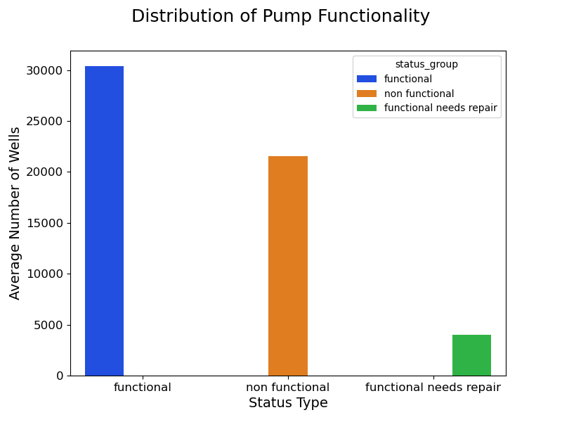

# Phase 3 Project: Pump it Up - Data Mining the Water Table

## Authors
Annie Zheng, Diego Fernandez, Gligorco Vasilev

## Project Overview

The [Well Beyond](https://www.wellbeyondwater.com/) app, developed by Well Aware, has been revolutionary in providing insights to non-governmental organizations (NGOs) about the status of wells. We aim to aid the Well Beyond app by adding a feature predicting the functionality of wells in Tanzania given attributes provided by the [Tanzanian Ministry of Water](https://www.maji.go.tz/). Using the provided dataset, we have developed models that can predict the functionality of wells with upwards of 86.4% accuracy.

## Navigating This Repository

| Folder/File Name | Contents    |
| ----------- | ----------- |
| phase_3_project_final_notebook | The final notebook with all models and plots |
| progress_notebooks   | A collection of notebooks developed throughout the project  |
| images      | Images used in the presentation and read.me     |
| plots  | Output plots |
| data  | Datasets downloaded and created |
| submissions | Csv files used to submit to the DrivenData competition |
| Presentation.pdf | A pdf of the final project presentation |

## Background
Water is the most essential substance for life on Earth, and many people around the world have limited access. In Tanzania, 16 out of 59 million people lack access to safe water, and can be forced to travel long distances (>3 miles on average) to collect water for basic needs every day. 

## Motivation
Gaining a better understanding of where wells need repair can help direct funding and resources to the places of greatest need, thus ensuring people in dire need of water can gain safe access.

## Data Understanding and Business Goals

Nearly half the wells in the Ministry of Water's dataset were completely non-functional or in need of repair.

Using these labels of *functional*, *non-functional*, or *functional needs repair*, we can develop machine learning models that classify well functionality with some key well features, including location, water level, construction year, and type. 

We have determined three key business goals to help Well Aware:
1. Insert our predictive model into the Well Beyond app to help NGOs better allocate resources for maintenance operations.
2. Determine key features with the highest predictive power on well functionality to decide what data needs to be gathered.
3. Recommend features of wells that may be useful for gaining better predictability of well status.

## Modeling and Evaluation

Model development underwent 8 phases. From the first model to the last, we increased overall accuracy by more than 30%. 

The final model dealt with the imbalanced dataset by oversampling the minority classes (*functional needs repair* and *non-functional*) and using grid search to determine the best hyperparameters for a classification decision tree.

| Model       | Description | Accuracy |
| ----------- | ----------- | ----------- |
| Baseline Model      | Always predicts functional | 54.91% |
| Logistic Regression | Trained on population data | 54.82% |
| Baseline Decision Tree| Using attributes amount_tsh and waterpoint_type | 64.4% |
| Decision Tree with OHE | One hot encoded the categorical attributes | 72.6% |
| Random Forest       | Trained with the top 20 Predictive Attributes | 79.4%|
| Random Forest w/ Undersampling   | Balanced the previous model with undersampling  | 70.7% |
| Random Forest w/ Oversampling    | Balanced the previous model with oversampling   | 84.3% |
| Tuned Random Forest w/ Oversampling | Determined the best hyperparameters for the previous model | 86.4% |

4 key attributes explained nearly 50% of the predictive power of the model:
- Location
- Water Level
- Year
- Well Type

## Conclusion

We recommend that Well Aware look into providing greater monetary incentives for the gathering of additional well data, primarily with regard to the construction year. Some useful additional information that could improve model performance, would be to find out the amount of water extracted from a well each day as well as the date of most recent maintenance. 

Overall, however, our model proves an excellent future feature for the Well Beyond app, with a well functionality predictive power of 86.4%. On top of this, since the focus is in determining whether a well needs repair, the respective classification accuracy of 94.4% shows that this will be incredibly useful to Well Aware.

